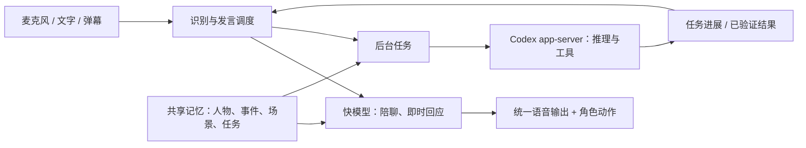

# 个人助手第一版：方案与接入验证

日期：2026-09-05。状态：本地可运行原型已实现并验收，见 README.md 和 docs/ACCEPTANCE.md；下文仍包含后续目标，不代表全部已交付。

## 推荐结论

将用户提到的 nekoplan 暂按 Project N.E.K.O. 猫娘计划理解。
最初把 N.E.K.O. 作为候选底座。检查固定提交 e1fa3482509132532a242d841b98d55ba03d4c4b 后，发现要把实际播放确认贯穿其模型会话、文本记录和多服务记忆路径，需要成套改造。第一版因此落为独立小应用，直接验证本地语音、播放确认上下文、场景记忆和 Codex app-server；保留 N.E.K.O. 作为后续复用候选，不冒称已经集成它。

最终体验：同一个角色日常陪聊，工作时能调用 Codex 干活，讲话可被打断，任务进度可以续接；重启后仍记得重要事情，工作、闲聊、直播时能想起不同的相关内容。

用户最新优先级：先完成本地桌面个人助手，再做直播。本地第一阶段继续使用已授权的模型 API 与本机 Codex 执行器。直播设计提前约束发言调度，但不成为本地可用版本的前置工程。

## 项目取舍

| 路线 | 可借用的能力 | 对本项目的判断 |
| --- | --- | --- |
| N.E.K.O. 为底座（后续候选） | Live2D、PNGTuber、猫咪桌宠、实时/文字对话、分层持久记忆、后台 Agent 通道 | 覆盖接近；当前只做了源码检查，第一版没有引入其多服务运行时 |
| AIRI 为底座 | Web/Electron 舞台、Live2D/VRM、音频交互及多种服务商 | 更偏重舞台、形象和游戏时有吸引力；Memory Alaya 仍标为 WIP |
| 自建小应用，借鉴现有项目（本次采用） | 播放确认、场景记忆、弹幕选择、Codex执行分开验证 | 已实现小范围本地闭环；使用动画猫/GIF，尚未集成Live2D和真实直播平台 |

Open-LLM-VTuber 当前主仓库明确说明长期记忆暂时移除，持久聊天记录不能直接满足本项目要求。MaiBot 用来参考什么时候说话、对谁回应、如何维持自然人格，不作为桌面音频运行时。

以上是官方仓库和文档核对结果。本轮没有安装运行这四个项目，也没有验证它们完整的开箱体验。

## 快慢模型如何配合

快模型可以自然陪聊、回答简单问题、说明任务已启动。遇到查资料、读文件、改代码等请求，创建后台任务交给 Codex；任务期间仍然可以聊天。快模型只根据真实任务事件报告进度，不能把“准备执行”说成“已经完成”。

复杂问题也可以先交给 DeepSeek-V3.2 做纯文本深思；涉及工具与执行状态的任务继续走 Codex，避免另造一套工具 harness。快慢路径使用同一角色设定与同一份经过筛选的记忆。

第一版优先采用可逐段测量的 ASR → 快模型 → TTS 路线。模型名含 Omni 不代表该服务商已经提供可用的双向实时音频会话，本轮没有验证 Omni 双工能力。后续可以替换为实时音频模型，保留相同调度和记忆接口。

## 本轮真实测量

本机、同一硅基流动地址、短中文对话，每个聊天模型 3 次，按轮次交替串行请求，`enable_thinking=false`、输出上限 100 tokens。TTFT 从发出请求算到首个非空正文增量，不包含推理增量。第一个请求包含建连，后续可能复用连接；数据只能用于这轮候选筛选，不能当作吞吐量或长期分位数。

| 模型 | 三次首字延迟（秒） | 中位数 | 第一版定位 |
| --- | --- | --- | --- |
| Qwen/Qwen3.5-35B-A3B | 0.569 / 0.520 / 0.501 | 0.520 | 快模型首选候选 |
| Qwen/Qwen3.5-9B | 0.577 / 0.537 / 0.523 | 0.537 | 备用候选；本轮未表现出速度优势 |
| inclusionAI/Ling-mini-2.0 | 0.680 / 0.703 / 0.651 | 0.680 | 中文表达的对照候选 |
| deepseek-ai/DeepSeek-V3.2 | 1.504 / 5.005 / 3.680 | 3.680 | 后台分析候选；这轮测的是非思考短回复 |

这不是完整中文角色质量评测，尚未比较长上下文、工具调用正确率、费用或高峰负载。不能由参数量推断实际速度，也不能由三条短回复判断人格质量。

其他真实请求：

- `Qwen/Qwen3-Embedding-0.6B`：成功，2 条文本各 1024 维，0.531 秒。
- `Qwen/Qwen3-Reranker-0.6B`：成功，3 条合成记忆中，工作回复偏好排在第一，0.119 秒。单例不能证明长期记忆召回质量，分数也不能直接当概率。
- `FunAudioLLM/CosyVoice2-0.5B:claire`：成功生成 5.32 秒的中文音频，24 kHz 单声道。首个 1024 字节块 0.247 秒，完整接收及初次解析约 0.653 秒。首块可能包含 WAV 头，不是实测扬声器开声时间。
- `/models` 发现 `FunAudioLLM/SenseVoiceSmall`；用上述合成音频转写成功，0.454 秒。没有采集真实麦克风，也没有测试噪声或回声。
- 流式 WAV 的头部使用未定长度，已按实际 PCM 长度生成正常 WAV，原始流文件保留。

原始输出在 `artifacts/siliconflow-probe.json`、`artifacts/voice-probe.json`，音频为 `artifacts/voice-sample.wav`。音频中“可以打断”的话是合成台词，不代表功能已经实现。

## Codex 接入已经证实什么

本机使用 `codex-cli 0.153.1`，启动单独的 `codex app-server --stdio` 子进程，沿用本机认证与配置；本轮返回模型为 `gpt-6-astra`。

1. `initialize` → `initialized` → `model/list` 成功。
2. `thread/start` → `turn/start` 成功，实际产生 `commandExecution`，读取随机测试文件并正确返回文件内的校验词。约 28.467 秒完成。
3. 对另一进行中的轮次发送 `turn/interrupt`，收到 `turn/completed` 且状态为 `interrupted`。从启动该轮到取消完成约 0.482 秒，其中人为等待 0.4 秒；没有测正在发声时的取消。
4. 退出这个测试 app-server，再启动新进程，`thread/resume` 成功。
5. 在新轮次中禁止读文件，模型从原会话历史正确返回先前校验词，约 10.598 秒。

这证明可以复用 app-server 的会话、工具、事件与持久历史，不只是一个 HTTP 健康检查。当前桌面 App 的全部连接器、浏览器会话、语音等能力是否能在独立客户端中复用，需要逐项能力探测；本轮仅验证了文件工具。会话历史恢复也不等于跨场景长期记忆。

客户端应固定 Codex 版本，使用该二进制生成的协议 schema。第一版本地 stdio 子进程即可，不需要暴露公网端口。测试不会修改当前 Codex 主任务；测试会话单独保留以支持复核。

## 打断和恢复的具体含义

| 用户行为 | 声音与前台 | 后台任务 |
| --- | --- | --- |
| 用户插话 | 本地检测到语音后立即停播、清空待播队列，监听新话语 | 默认继续，除非新话语要求停止或改变任务 |
| “先别说，继续做” | 停止当前播报，稍后择机呈现结果 | 继续 |
| “任务停一下” | 简短确认实际状态 | 发取消请求，等待服务端确认；保留完成项与待办项 |
| “接着刚才讲” | 从已播出的对话与最新语境重新生成后续内容 | 不重做已经完成的工具动作 |
| “继续刚才的任务” | 恢复该任务的沟通 | 恢复会话后开启新轮次，携带检查点并核对外部状态 |

关键实现：输出绑定轮次编号和语音段编号；打断后旧编号的迟到音频和结果不能覆盖新轮次。维护“模型生成了多少”和“用户实际听到多少”两种记录，不能把未播放内容假定为用户已听到。

用户明确要求：**打断时，把没说完的内容从模型对话上下文去掉。**

- 正文在生成时是临时草稿，按播放器实际消费的音频进度提交为已说出的内容；TTS 生成完成、网络收到音频或音频入队均不等于已播出。
- 打断后保留已播出的文字前缀，删除当前未播出的后缀、后续待播句子和音频；整段都没播出则不留下该条 assistant 发言。
- 通过音频与文本对齐确定截断位置；第一版无法精确到词时，保守取已确认播出的短片段，不能把整个生成句子当成已说出。
- 未说出的草稿不进入对话摘要、长期记忆抽取或下一轮快慢模型的对话输入。取消旧生成，并拒收旧轮次迟到的数据。
- 如果服务端已把完整草稿写入模型会话，下一轮前必须截断或重建该会话的实际输入，仅删 UI 消息不算完成。
- Codex 已经执行过的工具动作和任务结果保留在任务记录中；尚未说出的口头解释不进入角色的已说对话。用户后来要求继续时，依据已说上下文与真实任务记录重新生成，不把被丢弃的原稿自动塞回去。

官方 `turn/interrupt` 是取消，`thread/resume` 是重新打开会话。当前方案的“任务恢复”指基于任务记录与已完成证据继续工作，不承诺从任意工具进程的中间执行点恢复。已发生的写文件或外部动作不会自动回滚，恢复前检查一次实际状态以避免重复执行。

## 长期记忆与场景回想

优先扩展 N.E.K.O. 已有持久化和召回，不同时养两套互不一致的人格记忆。Codex 的任务记录只承担执行历史，角色记忆由同一个权威记忆入口提供。

第一版需要四类可解释内容：

| 内容 | 示例 | 处理原则 |
| --- | --- | --- |
| 稳定事实与偏好 | 工作时先给结论；讨厌重复确认 | 保存来源、适用场景与生效时间；新说法可取代旧说法 |
| 情景事件 | 上次直播出了什么问题；昨天讨论过什么 | 保留时间、人物、项目和对话来源 |
| 待办与承诺 | 答应查一个项目；任务暂停在什么步骤 | 显式完成、取消、过期，不把未完成事项压缩掉 |
| 角色与关系 | 固定人设、称呼、共同经历 | 推断标成推断；不凭一次闲聊自动固化人格 |

每条记忆至少带有主体、来源消息、发生时间、适用场景、可见范围、当前状态；派生摘要关联来源 ID。场景先提供“工作 / 陪聊 / 直播”三个显式模式，再结合当前项目、话题、参与者和任务作细化。场景偏好可以软匹配，但私密/公开范围必须硬过滤。

召回顺序：

1. 先按主体、可见范围、删除/失效状态筛选。
2. 从时间、关键词和语义相关性取候选，必要时重排；时间查询按事件时间解释。
3. 只把少量与当前任务有关的记忆注入本轮；不把所有旧对话塞进提示词。
4. 场景进入和空闲时预取；后台整理不阻塞实时开口。结果晚到时先判断是否仍然相关，不强行插入。

例如：“直播时可以多开玩笑”和“工作时少开玩笑”可以同时成立；“以前喜欢甜咖啡，现在改喝无糖”需要时间与更正关系。直播不能因为语义相似就召回只适合私聊的经历。

记忆必须能查看来源、更正和忘记。遗忘要同步处理索引、派生摘要和上下文缓存；已把旧信息注入的活跃会话也需重建相关上下文，否则数据库删了仍可能继续回忆。第一版先通过真实重启回归，再考虑更复杂的反思和知识图谱。

## 直播与形象

形象统一接收待机、听取、思考、说话、表情等状态。先复用 N.E.K.O. 可用且授权合适的现成角色；Live2D 与 GIF/APNG/PNGTuber 共用同一组状态，素材切换不影响任务和记忆。

直播先支持 OBS 可捕获的透明舞台、角色、字幕和专用输出音频，再接一个弹幕平台。桌面助手与直播使用同一个角色身份，但记忆可见范围不同。

Neuro 式互动还需要发言选择与主动行为：从弹幕、游戏/屏幕事件、主播语音和空闲时间中选择值得回应的内容。单一发言调度器控制优先级；主播插话优先，弹幕去重聚合，主动话题不能挤占人类发言，后台任务结果在合适的空隙交付。第一版不承诺自主游戏能力。

### 直播消息积压：取消逐条回答的默认假设

用户已经遇到：大量消息到达后，系统逐条回答，每条发言都需要等待前面回复生成和播完。即使模型 TTFT 很低，排队等待也会持续增长；过长的回复进一步占满发声时间。

目标是持续感知当前对话，并及时选择有意义的回应。实现规则：

1. 收消息与说话独立进行。说话期间仍接收并更新候选消息，不能等当前回复播完才开始读后续输入。
2. 输入端保留有界、可过期的候选集合；按话题合并、去重、选择回应对象。不会每收到一条消息就启动一次模型生成并排入 TTS 队列。
3. 同一问题多人发时用一段短话合并回应；普通闲聊可择要回应，明确问答和主播指令优先。过期消息退出候选，不让旧弹幕拖成几分钟后的补课。
4. 每次只规划短发言，通常先一到两句。长解释分段，每段开始前检查新消息与话题是否变化，再决定继续、缩短或改答。音频预生成保持短缓冲。
5. 普通新弹幕不会让角色每几个字就被切断；主播插话可以即时打断，其他消息优先在短句边界影响下一次发言。旧草稿已失去相关性就取消，不能仅并行生成更多回答然后继续排队念。
6. 被选中的回复关联原始消息 ID，一次回应可关联多条输入，避免重复回复同一问题。

验收同时记录：消息到达→被选中→首个相关正文→实际相关语音播出；分开报告排队时间、模型时间和音频时间。合并回应分别关联到每条原始消息。不把无意义的“收到”算作有效回答，不通过忽略大量消息美化时延；同时报告回应覆盖率、合并率、过期/未选中比例和最老候选年龄。

### Neuro 官方可证实的机制与本项目采用的设计

2026-09-05 核对 VedalAI 官方游戏 SDK，公开协议明确支持：

- `context.silent=true`：加入信息而不提示回复；即使为 false，也只是可能回应，忙于交流时可以不回应。
- `actions/force.priority`：low 等待当前发言结束，medium 提前收尾，high 立即处理并缩短发言，critical 中断当前声音。
- `speech_finished`：区分正常结束和取消，取消也有最终完成通知。

来源：[VedalAI Neuro API Specification](https://github.com/VedalAI/neuro-sdk/blob/main/API/SPECIFICATION.md)。这些是游戏接口合同；本轮未找到足以确认 Twitch 弹幕采样算法、内部推理调度或未播出文本裁剪方式的官方证据。不能把仿制项目和观众推测写成 Neuro 的真实内部实现。

针对本项目，采用“持续收集当前情况，短段决定下一次发言”：

- 感知更新默认不创建一个待回答任务。廉价的规则做去重、过期和来源优先级，快模型在需要开口时选择本次回应对象与内容；不为每条弹幕额外串行调用一个导演模型。
- 本地对话：用户连续说“帮我看项目”“先只看语音”“不要改文件”时，结合为最新完整意图。明确任务与约束保留到完成或取消，不能套用直播闲聊的过期丢弃规则。
- 直播：关联当前话题、正在对话的观众及相关追问，多人同类问题合并回答。每一条新弹幕都强制取消生成也会导致始终说不出话；普通更新在短句边界生效，用户真实插话和停止指令立即让出发言权。
- 嘴上只保留当前短段与少量可丢弃的预取音频。下一段可预生成以减少断句空隙，但播出前复核其依据的消息版本；不维护多条完整回答的 FIFO。
- 后台 Codex 任务独立执行，结果到达作为待选择的信息；只有合适的发言时机才口头报告。

物理约束示例（假设，非实测）：10 条消息同时到达，每条回答播 6 秒，即使模型瞬间生成，逐条播报也使最后一条至少等 54 秒。要降低等待，必须共同控制回应选择、合并和发言长度。

[LiveKit 的回合文档](https://docs.livekit.io/agents/logic/turns/)明确描述打断后按已听到的部分截断对话历史；[转写文档](https://docs.livekit.io/agents/multimodality/text/)描述字幕随播放同步且打断时截断。这里借鉴其语义和实现方向，不代表现用 CosyVoice2、桌面播放器和 N.E.K.O. 已自动满足要求；对齐精度、播放进度回报和实际模型输入仍需端到端核对。

N.E.K.O. 继续作为候选底座，但选择以这条最短路径验收为准：本地持续输入、短段发言、实际打断、下一轮输入没有未播出的后缀。若不通过，先定位并替换对应语音/调度部分，不能用已有功能数量代替这项验收。

## 第一版交付顺序与验收

1. **先跑通桌面陪伴**：可见角色、中文文本/语音往返、明确工作/陪聊模式，快模型先用 Qwen3.5-35B-A3B。
2. **加入执行与打断**：聊天中发起一个 Codex 文件任务；后台执行时还能插话；停播后无旧音频漏出；检查下一轮实际模型输入，只含已播出的回复前缀，未播出的后缀也不进入摘要和记忆；任务取消有确认，恢复不重复已完成动作。
3. **验证长期记忆**：自然聊天记入事实 → 退出整个应用 → 新会话按场景召回 → 显示来源 → 更正/删除 → 再重启验证。不用仅把原会话重新打开来冒充长期记忆。
4. **本地版本验收之后再做直播**：OBS 实际采集到角色、字幕和音频；接一个弹幕入口；播出时不召回私聊限定记忆。用突发消息回放验证合并回应、短句发言和过期淘汰，不能逐条累积待播回答。

第一阶段性能验收要实际量麦克风端点、模型首正文、TTS 首可解码帧和扬声器出声；单独量插话到声音消失的时间。当前接口延迟只作为起点。

本轮完成的是接入可行性验证和可评审方案，未完成 N.E.K.O. 集成、桌面打包、真实麦克风打断或 OBS 直播验收。

## 当前来源

- [N.E.K.O. 主仓库](https://github.com/Project-N-E-K-O/N.E.K.O)
- [N.E.K.O. Agent 通道与取消](https://project-neko.online/architecture/agent-system)
- [N.E.K.O. 持久记忆和召回](https://project-neko.online/architecture/memory-system)
- [AIRI 主仓库与路线图](https://github.com/moeru-ai/airi)
- [Open-LLM-VTuber 主仓库](https://github.com/Open-LLM-VTuber/Open-LLM-VTuber)
- [MaiBot 用户手册](https://docs.mai-mai.org/manual/)
- [Codex app-server 官方文档](https://developers.openai.com/codex/app-server/)
- [SiliconFlow Chat Completions](https://docs.siliconflow.cn/docs/api/chat-completions-post)
- [SiliconFlow TTS](https://docs.siliconflow.cn/docs/userguide/capabilities/text-to-speech)
